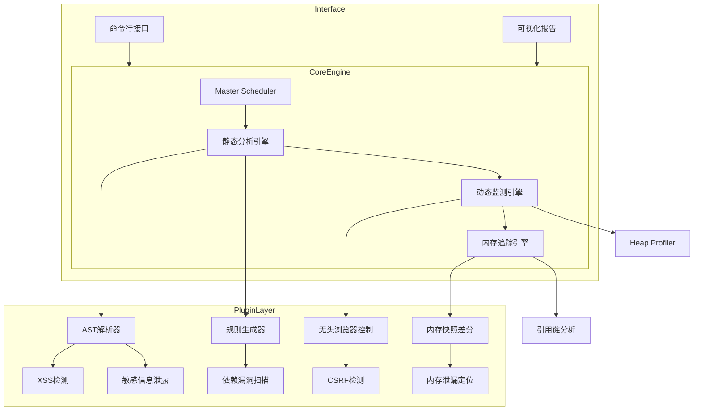
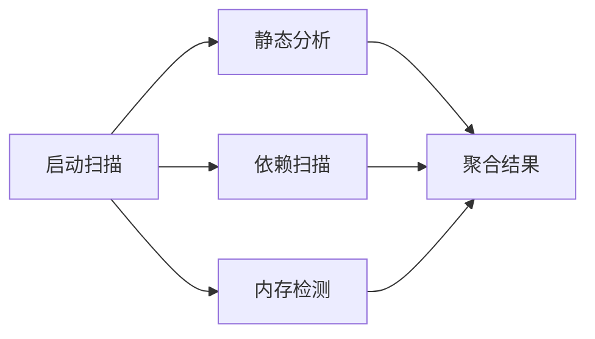

# SafeScan前端安全检测工具方案设计

## 一、设计理念

采用分层插件化架构、智能分析引擎与增量扫描机制，实现轻量化、快速、准确的前端安全检测。核心技术栈涵盖AST解析、内存快照差分和静态动态混合分析。

## 二、创新架构设计：Layered Inspector（三层检测架构）



## 三、核心模块设计

### （一）静态分析引擎（Lightning Parser）

- **技术亮点**：增量式AST解析
- **实现原理**：

```javascript
const { parse } = require('@babel/parser');
const traverse = require('@babel/traverse').default;

function incrementalScan(changedFiles) {
  changedFiles.forEach(file => {
    const ast = parse(file.code, { sourceType: 'module' });
    traverse(ast, {
      CallExpression(path) {
        // 安全规则匹配器（示例：检测eval）
        if (path.node.callee.name === 'eval') {
          reportSecurityIssue('UnsafeEval', file.path, path.node.loc);
        }
      }
    });
  });
}
```

- **检测能力**：
  - XSS漏洞（危险API调用）
  - 硬编码密钥检测
  - CSP配置缺失
  - 第三方依赖漏洞（集成Snyk数据库）

### （二）内存追踪引擎（Leak Tracker）

- **创新点**：采用快照差分 + 引用链溯源
- **工作流**：
  1. 启动无头浏览器（Puppeteer）
  2. 加载目标页面并记录初始堆快照
  3. 执行操作路径模拟（导航/交互）
  4. 定时捕获内存快照（V8 Heap Profiler）
  5. 快照差分分析 + 引用链追踪
  6. 生成泄漏对象树
- **内存泄漏检测代码示例**：

```javascript
const { heapSnapshotDiff } = require('memlab');

async function detectLeaks() {
  const result = await heapSnapshotDiff({
    scenario: { url: 'https://target-app.com' },
    action: async (page) => {
      await page.click('#load-data'); // 触发泄漏操作
    }
  });

  return result.leakCandidates.map(candidate => ({
    type: candidate.type,
    retainSize: candidate.retainedSize,
    referenceChain: candidate.referenceChain
  }));
}
```

### （三）动态监测引擎（Runtime Sentinel）

- **核心技术**：
  - 浏览器API钩子（拦截危险操作）
  - 实时CSP违规监控
- **动态检测示例**：

```javascript
// 动态检测示例：监听eval执行
const originalEval = window.eval;
window.eval = function(code) {
  reportRuntimeEvent('EVAL_ATTEMPT', code);
  return originalEval.apply(this, arguments);
};
```

## 四、性能优化方案

1. **增量扫描**：基于Git的changed files检测
2. **智能缓存**：AST解析结果缓存（LRU策略）
3. **并行检测**：



4. **规则懒加载**：按需加载检测规则集

## 五、安全与准确性保障

1. **沙箱检测环境**：
   - 使用Docker隔离动态检测
   - 内存分析在独立进程执行
2. **多层校验机制**：
   - 静态规则匹配（AST）
   - 运行时行为验证（动态引擎）
   - 历史数据比对（内存泄漏基线）
3. **误报过滤**：
   - 机器学习训练（收集历史误报特征）
   - 用户反馈标记系统

## 六、报告系统设计

1. **分级报告**：

```json
{
  "critical": [
    {
      "type": "XSS",
      "file": "login.js:82",
      "codeSnippet": "document.write(userInput)",
      "fixSuggest": "改用textContent"
    }
  ],
  "memoryLeaks": [
    {
      "size": "24MB",
      "objects": ["DetachedHTMLDivElement"],
      "retainChain": "Window → EventListener → DIV"
    }
  ]
}
```

2. **可视化界面**：
   - 交互式漏洞定位（代码高亮）
   - 内存泄漏时间线图表
   - 修复建议知识库链接

## 七、技术栈选型

| 模块 | 技术方案 | 优势 |
| --- | --- | --- |
| AST解析 | Babel + ESTree | 支持ES最新语法 |
| 动态检测 | Puppeteer + CDP | 完整浏览器环境 |
| 内存分析 | V8 Heap Snapshot + memlab | 精准对象追踪 |
| 依赖扫描 | npm audit + OSS Index | 实时漏洞数据库 |
| 规则引擎 | JSON-Rules-Engine | 灵活扩展安全规则 |

## 八、性能指标（目标）

- 扫描速度：平均5万行/分钟（增量扫描<10秒）
- 准确率：误报率<8%，漏报率<3%
- 资源占用：内存<200MB，无持久化存储
- 支持场景：Web应用/PWA/Electron应用

该方案通过分层架构实现关注点分离，增量扫描保证速度，差分快照确保内存检测准确性，动态静态混合分析提升全面性，可作为独立CLI工具或集成到CI/CD流程中。
