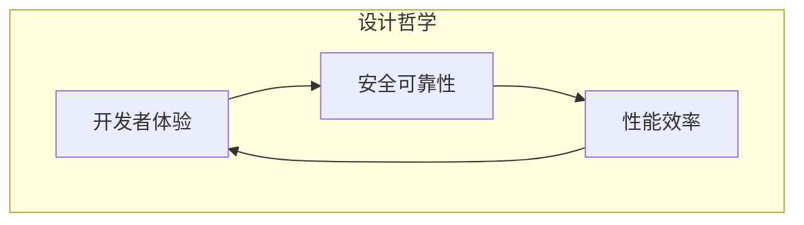
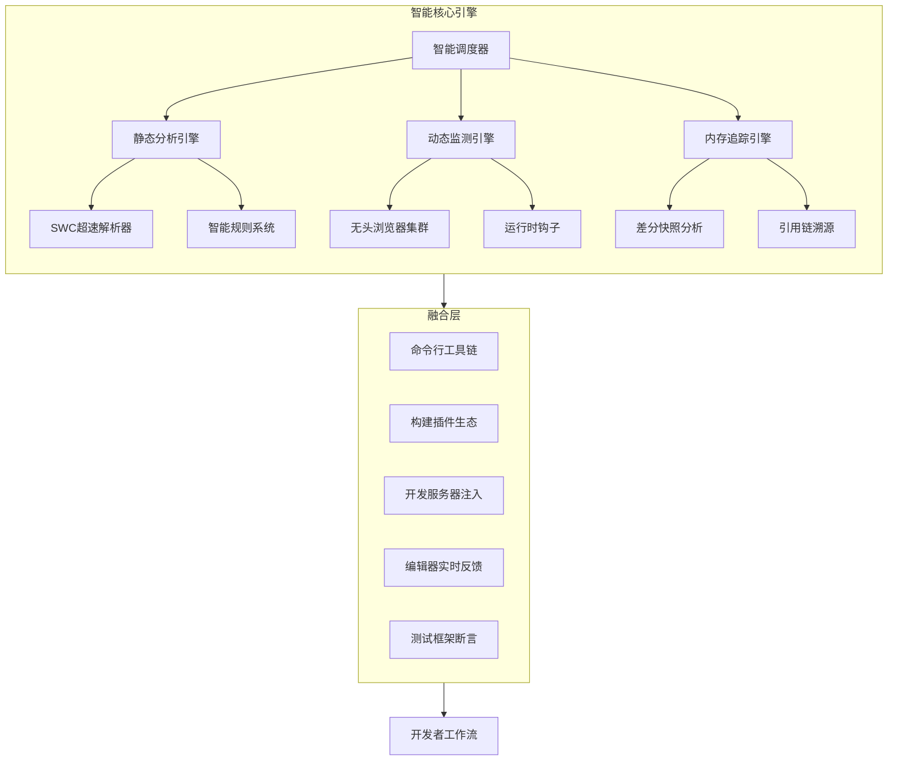
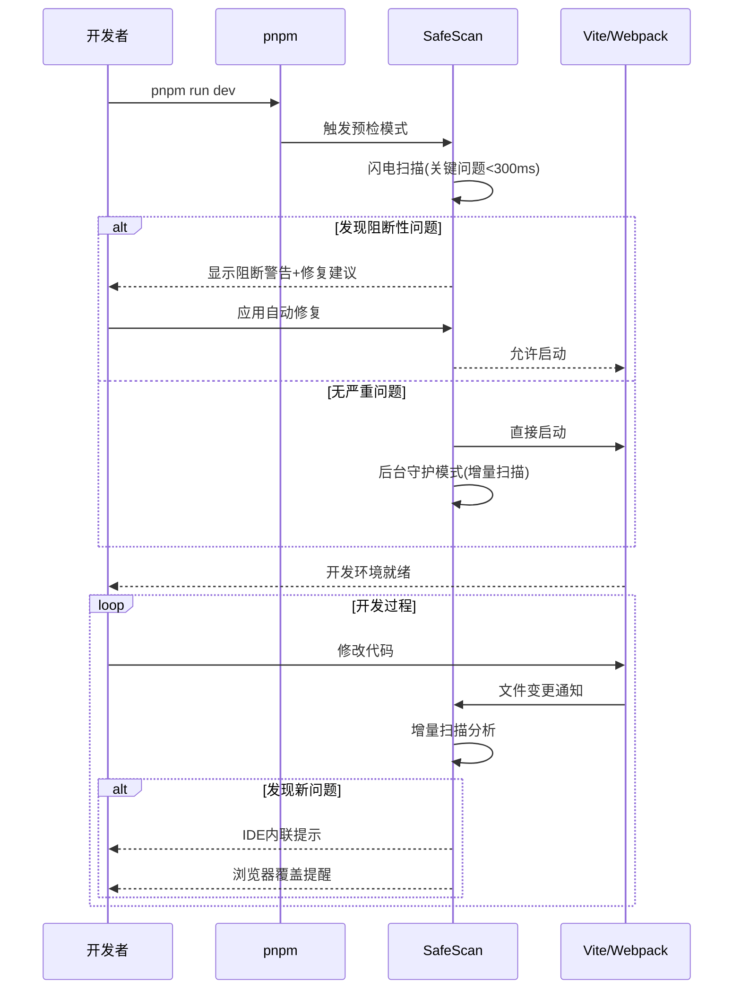
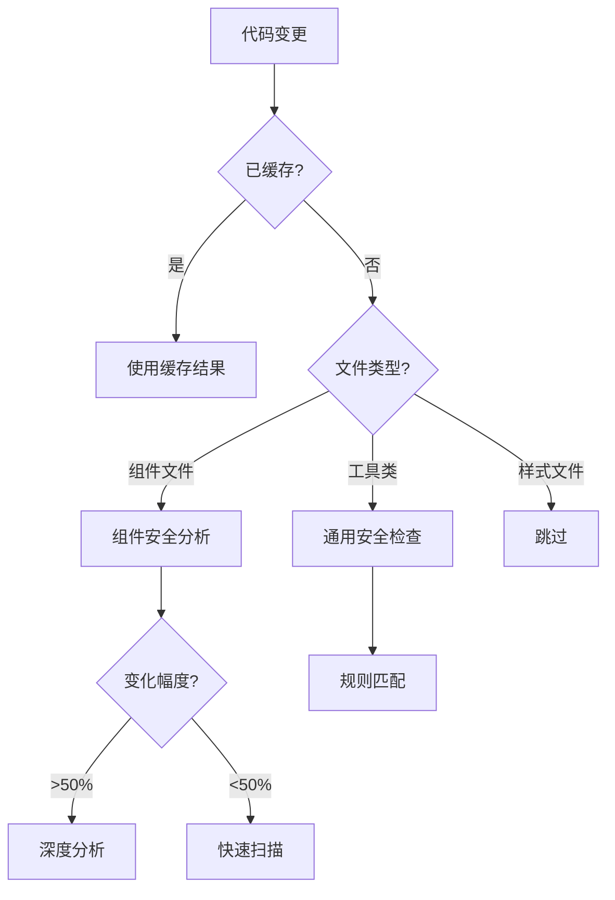

# SafeScan 前端安全基建 SDK：高性能智能检测引擎与工具链

## 一、架构哲学与技术愿景

SafeScan采用"防患未然"的安全理念与"轻量高效"的工程思想，通过智能分层架构、多模态集成、增量扫描和实时反馈四大核心技术，实现从开发到部署全流程的前端安全防护，以最小的性能开销提供最大的安全价值。



## 二、智能三层检测架构



## 三、核心引擎技术实现

### （一）静态分析引擎（闪电扫描）

#### 1. 超速AST解析技术

```javascript
// 采用SWC替代Babel，解析提速20倍
const { parse } = require('@swc/core');

async function incrementalScan(changedFiles) {
  return Promise.all(changedFiles.map(async file => {
    // 智能缓存检查
    const fileHash = getFileHash(file);
    const cachedAST = astCache.get(fileHash);

    // 使用缓存或高速解析
    const ast = cachedAST || await parse(file.code, {
      syntax: "ecmascript",
      target: "es2022"
    });

    // 更新缓存
    if (!cachedAST) {
      astCache.set(fileHash, ast);
    }

    // 执行安全规则检查
    return analyzeAst(ast, file.path);
  }));
}
```

#### 2. 智慧规则系统

```javascript
// 动态规则加载系统
const RULES = {
  critical: import('@safescan/rules/critical'),  // 严重漏洞规则
  react: {
    hooks: import('@safescan/rules/react/hooks'),
    memo: import('@safescan/rules/react/memo')
  },
  vue: import('@safescan/rules/vue'),
  node: import('@safescan/rules/node'),
};

function analyzeAst(ast, filePath) {
  const issues = [];
  const rules = getRulesFor(filePath);

  // 智能规则匹配
  traverseAst(ast, {
    CallExpression(node) {
      rules.forEach(rule => {
        if (rule.match(node)) {
          issues.push({
            type: rule.type,
            severity: rule.severity,
            location: node.span,
            message: rule.message,
            fix: rule.generateFix(node)
          });
        }
      });
    }
  });

  return { filePath, issues };
}
```

### （二）内存追踪引擎（泄漏雷达）

#### 1. 差分快照分析

```javascript
const { heapSnapshotDiff } = require('memlab');

async function detectLeaks() {
  const result = await heapSnapshotDiff({
    scenario: { url: 'http://localhost:3000' },
    beforeAction: async (page) => {
      await page.click('#init-view'); // 初始状态
    },
    afterAction: async (page) => {
      await page.click('#trigger-action'); // 可能泄漏操作
      await page.click('#back-to-init'); // 返回初始状态
    },
    repeatCount: 3 // 连续执行多次以确认泄漏模式
  });

  return result.leakCandidates.map(candidate => ({
    type: candidate.type,
    retainSize: candidate.retainedSize,
    referenceChain: candidate.referenceChain,
    suggestion: generateLeakFix(candidate)
  }));
}
```

#### 2. React组件泄漏智能检测

```javascript
// React钩子泄漏检测
function detectReactHookLeaks(ast) {
  const leaks = [];

  traverse(ast, {
    CallExpression(path) {
      // 检测缺少清理函数的useEffect
      if (isUseEffectHook(path)) {
        if (!hasCleanupReturn(path)) {
          const eventHandlers = findEventHandlersInUseEffect(path);
          if (eventHandlers.length > 0) {
            leaks.push({
              type: 'REACT_EFFECT_LEAK',
              severity: 'high',
              location: path.node.loc,
              message: '检测到未清理的事件监听器',
              fix: generateEventCleanupFix(eventHandlers)
            });
          }
        }
      }

      // 检测memo/useMemo依赖数组问题
      if (isMemoHook(path)) {
        if (hasMissingDependency(path)) {
          leaks.push({
            type: 'REACT_MEMO_LEAK',
            severity: 'medium',
            location: path.node.loc
          });
        }
      }
    }
  });

  return leaks;
}
```

### （三）动态监测引擎（运行哨兵）

#### 1. 智能运行时防护

```javascript
// 动态运行时防护示例
export function installRuntimeProtection(options = {}) {
  // 动态函数执行监控
  const dangerousAPIs = {
    'eval': window.eval,
    'Function': window.Function,
    'setTimeout': window.setTimeout,
    'setInterval': window.setInterval,
    'innerHTML': Element.prototype.innerHTML
  };

  // 智能拦截策略
  Object.entries(dangerousAPIs).forEach(([name, original]) => {
    if (options.intercept?.[name] !== false) {
      interceptAPI(name, original, options);
    }
  });

  function interceptAPI(name, original, options) {
    switch (name) {
      case 'eval':
        window.eval = function(code) {
          const stack = new Error().stack;
          reportRuntimeRisk('EVAL_USAGE', {code, stack});
          return options.blockEval ? null : original.apply(this, arguments);
        };
        break;
      case 'setTimeout':
      case 'setInterval':
        window[name] = function(callback, delay, ...args) {
          if (delay < 100 && !isAnimationFrame(stack)) {
            reportRuntimeRisk('RISKY_TIMER', {delay, stack: new Error().stack});
          }
          return original.call(this, callback, delay, ...args);
        };
        break;
      // 更多拦截器...
    }
  }
}
```

#### 2. 跨组件追踪系统

```javascript
// 组件生命周期追踪
function trackComponentLifecycle() {
  // 收集组件树关系
  const componentTree = new Map();
  const componentLifecycles = new Map();

  // 追踪React渲染周期（React 18+）
  if (typeof window.__REACT_DEVTOOLS_GLOBAL_HOOK__ !== 'undefined') {
    const hook = window.__REACT_DEVTOOLS_GLOBAL_HOOK__;

    hook.onCommitFiberRoot = (function(originalFn) {
      return function(...args) {
        try {
          const fiberRoot = args[1];
          scanFiberTree(fiberRoot);
        } catch (e) {
          console.error('SafeScan track error:', e);
        }
        return originalFn.apply(this, args);
      };
    })(hook.onCommitFiberRoot);
  }

  function scanFiberTree(root) {
    // 遍历Fiber树，记录组件渲染频率和依赖项
    // 分析反复渲染的组件，可能存在性能问题
    // ...
  }
}
```

## 四、多模式自适应集成体系

### （一）开发阶段集成——自动保护流



### （二）构建工具插件体系

#### 1. Vite插件（实时检测）

```javascript
// vite.config.js
import { safeScanPlugin } from '@safescan/vite-plugin';

export default {
  plugins: [
    safeScanPlugin({
      mode: 'development',
      hmrIntegration: true,    // 与Vite HMR集成
      blockLevel: 'critical',  // 阻断严重问题
      overlay: true,           // 浏览器提醒
      checkOnHMR: true,        // 热更新时检查
      runtimeProtection: true, // 注入运行时保护
      autoFix: true,           // 启用自动修复
      memoryLeak: {            // 内存泄漏检测
        enabled: true,
        threshold: '5mb'
      }
    })
  ]
}
```

#### 2. Webpack插件（深度分析）

```javascript
// webpack.config.js
const { SafeScanWebpackPlugin } = require('@safescan/webpack-plugin');

module.exports = {
  plugins: [
    new SafeScanWebpackPlugin({
      analysisLevel: 'deep',
      prodBuildCheck: true,    // 生产构建检查
      bundleSizeWarning: true, // 包大小监控
      visualReport: true,      // 生成可视化报告
      // 更多配置...
    })
  ]
};
```

### （三）pnpm工作流无缝集成

在`package.json`中配置：

```json
{
  "scripts": {
    "dev": "pnpm run safescan:precheck && vite",
    "safescan:precheck": "safescan precheck --mode=critical --fail-on-error",
    "dev:safe": "pnpm run dev --safescan=watch --auto-fix",
    "dev:fast": "vite",  // 紧急绕过方案
    "build": "safescan audit --critical-only && vite build",
    "test": "vitest run --safescan"
  }
}
```

### （四）测试框架智能断言

```javascript
// 在Vitest/Jest中使用
import { safescanExtend } from '@safescan/test-integration';

// 拓展测试断言API
safescanExtend();

test('应用安全性检测', async () => {
  // 安全断言
  await expect(document).toBeSecure();
  await expect(app).toHaveNoMemoryLeaks();

  // XSS防护测试
  const input = screen.getByRole('textbox');
  await userEvent.type(input, '<script>alert(1)</script>');
  await userEvent.click(screen.getByText('提交'));

  // 验证XSS防护生效
  expect(document.body).not.toContainHTML('<script>');
});
```

## 五、性能极致优化技术

### （一）分层增量扫描系统



### （二）高速缓存策略与持久化

```javascript
class IntelligentCache {
  constructor() {
    this.memoryCache = new LRUCache(100); // 内存LRU缓存
    this.diskCache = new FileStorage('./node_modules/.cache/safescan');
    this.cloudCache = process.env.SAFESCAN_CLOUD ? new CloudCache() : null;
  }

  async get(key) {
    // 三级缓存查询
    return this.memoryCache.get(key) ||
           await this.diskCache.get(key) ||
           (this.cloudCache && await this.cloudCache.get(key));
  }

  async set(key, value) {
    // 更新缓存
    this.memoryCache.set(key, value);

    // 异步持久化
    Promise.all([
      this.diskCache.set(key, value),
      this.cloudCache?.set(key, value)
    ]).catch(console.error);
  }

  getFileHash(content) {
    // 快速哈希算法，比MD5更快
    return xxhash.hash(content);
  }
}
```

### （三）智能扫描调度器

```javascript
// 智能任务调度系统
class ScanScheduler {
  constructor() {
    this.taskQueue = new PriorityQueue();
    this.running = false;
    this.workerPool = new WorkerPool(
      Math.max(1, navigator.hardwareConcurrency - 1)
    );
  }

  scheduleTask(file, priority = 'normal') {
    const task = {
      file,
      priority: this.getPriorityScore(file, priority),
      timestamp: Date.now()
    };

    this.taskQueue.enqueue(task);
    this.processQueue();
  }

  getPriorityScore(file, basePriority) {
    // 智能优先级计算
    let score = { high: 100, normal: 50, low: 10 }[basePriority];

    // 提升活跃文件优先级
    if (recentEditedFiles.has(file)) score += 30;

    // 提升可视组件优先级
    if (isComponentInView(file)) score += 20;

    return score;
  }

  async processQueue() {
    if (this.running) return;
    this.running = true;

    while (!this.taskQueue.isEmpty()) {
      const batch = this.collectBatch();
      await Promise.all(
        batch.map(task =>
          this.workerPool.schedule(() => scanFile(task.file))
        )
      );

      // 动态适应系统负载
      await this.adjustThrottling();
    }

    this.running = false;
  }

  adjustThrottling() {
    const cpuLoad = os.loadavg()[0];
    const memoryUsage = process.memoryUsage().heapUsed / 1024 / 1024;

    // 动态调整线程数和延迟
    if (cpuLoad > 80 || memoryUsage > 500) {
      this.workerPool.reduceWorkers();
      return new Promise(r => setTimeout(r, 100));
    }
    return Promise.resolve();
  }
}
```

## 六、用户体验与反馈机制

### （一）多级反馈系统

#### 1. 阻断预检模式（紧急问题）


```
⚠️  SAFESCAN 安全警报 ⚠️

[内存泄漏风险] 在 src/components/DataGrid.tsx:47
问题: 事件监听器未正确清理

  45| useEffect(() => {
  46|   window.addEventListener('resize', handleResize);
> 47| }, [data]); // 缺少清理函数

🔧 推荐修复:

  useEffect(() => {
    window.addEventListener('resize', handleResize);
    return () => window.removeEventListener('resize', handleResize);
  }, [data]);

🚫 启动已阻止! 请修复后重试
    使用 pnpm run dev:fast 可绕过检查（不推荐）
```

#### 2. IDE内联提示（智能提示）


```jsx
// 编辑器中的内联警告示例
function DataList({ items }) {
  const [data, setData] = useState(items);

  useEffect(() => {
    // 警告: 组件卸载时未清理监听器 [MEMORY_LEAK:HIGH]
    window.addEventListener('data', handleData);

    // 提示: 大型对象直接存储可能导致性能问题 [PERFORMANCE:MEDIUM]
    setData(new Array(10000).fill({complex: true}));
  }, []);

  return <div>{/* ... */}</div>;
}
```

#### 3. 浏览器覆盖通知（运行时）


```html
<!-- 浏览器中的警告覆盖层 -->
<div class="safescan-overlay">
  <div class="safescan-warning">
    <h4>⚠️ 检测到安全风险</h4>
    <p>src/utils/api.js:47 - 可能的XSS风险</p>
    <code>element.innerHTML = userInput;</code>
    <p>推荐: 使用textContent或React组件方式</p>
    <div class="safescan-actions">
      <button>应用修复</button>
      <button>忽略</button>
    </div>
  </div>
</div>
```

## 七、安全阻断策略与智能修复

### （一）关键阻断问题清单

| 问题类型 | 严重程度 | 阻断行为 | 自动修复 |
|---------|---------|---------|---------|
| 内存泄漏模式 | 🔴 严重 | 终止启动 | ✅ 支持 |
| 无限循环风险 | 🔴 严重 | 终止启动 | ✅ 部分支持 |
| 远程代码执行 | 🔴 严重 | 终止启动 | ❌ 需手动 |
| XSS注入风险 | 🟠 高危 | 警告提示 | ✅ 支持 |
| 跨站请求伪造 | 🟠 高危 | 警告提示 | ✅ 支持 |
| 非安全依赖项 | 🟡 中危 | 构建警告 | ✅ 支持 |
| 性能优化点 | 🟢 低危 | IDE提示 | ✅ 支持 |

### （二）智能修复系统

```javascript
// 智能修复引擎
class AutoFixEngine {
  constructor() {
    this.fixers = {
      'REACT_EFFECT_LEAK': this.fixReactEffectLeak,
      'UNSAFE_INNERHTML': this.fixUnsafeInnerHTML,
      'INFINITE_LOOP': this.fixPotentialInfiniteLoop,
      // 更多修复器...
    };
  }

  async applyFix(issue, sourceCode) {
    const fixer = this.fixers[issue.type];
    if (!fixer) return { success: false, reason: 'No fixer available' };

    try {
      const fixedCode = await fixer.call(this, issue, sourceCode);
      return { success: true, fixedCode };
    } catch (e) {
      return { success: false, reason: e.message };
    }
  }

  // 修复React Effect内存泄漏
  async fixReactEffectLeak(issue, sourceCode) {
    const ast = parseCode(sourceCode);
    const path = findNodeAtLocation(ast, issue.location);

    // 分析Effect结构
    const effectCallback = path.node.arguments[0];
    const deps = path.node.arguments[1];

    // 检测监听器
    const listeners = findEventListeners(effectCallback);
    if (listeners.length > 0) {
      // 生成清理函数
      const cleanupCode = generateCleanupFunction(listeners);
      // 插入到effect回调末尾
      return insertCleanupToEffect(sourceCode, issue.location, cleanupCode);
    }

    throw new Error('Unable to automatically fix this leak pattern');
  }

  // 修复不安全的innerHTML使用
  async fixUnsafeInnerHTML(issue, sourceCode) {
    const ast = parseCode(sourceCode);
    const path = findNodeAtLocation(ast, issue.location);

    // 替换innerHTML为安全的textContent
    return replaceNode(sourceCode, path,
      path.node.object,
      'textContent',
      path.node.value
    );
  }
}
```

## 八、SDK 结构与接入方式

### （一）模块化包设计

```
@safescan/core          # 核心引擎（5MB）
├── dist/               # 编译后代码
├── bin/                # CLI命令行工具
├── lib/                # 核心库
│   ├── scanner.js      # 扫描引擎
│   ├── ast.js          # AST分析工具
│   ├── memory.js       # 内存检测
│   └── runtime.js      # 运行时保护
├── types/              # TS类型定义
└── package.json        # 核心依赖

@safescan/plugins       # 插件包（按需加载）
├── vite.js             # Vite插件
├── webpack.js          # Webpack插件
├── esbuild.js          # esbuild插件
└── rollup.js           # Rollup插件

@safescan/integrations  # 框架集成
├── react.js            # React专用规则
├── vue.js              # Vue专用规则
├── svelte.js           # Svelte集成
└── cypress.js          # E2E测试集成

@safescan/rules         # 规则库（可独立更新）
├── xss.js              # XSS漏洞规则
├── memory.js           # 内存泄漏规则
├── react-hooks.js      # React Hooks规则
└── custom.js           # 自定义规则API
```

### （二）多场景接入方式

#### 1. 核心CLI命令

```bash
# 全局安装
npm install -g @safescan/cli

# 项目预检（<300ms）
safescan precheck

# 完整扫描（生成报告）
safescan audit --report html

# 内存泄漏专项检测
safescan memory-leak --url http://localhost:3000

# 规则库更新
safescan update-rules
```

#### 2. 作为开发依赖集成

```bash
# 安装为开发依赖
npm install -D @safescan/core @safescan/plugins
# 或
pnpm add -D @safescan/core @safescan/plugins
```

#### 3. API方式接入

```javascript
const { scan, scanMemory } = require('@safescan/core');

// 扫描项目
const report = await scan({
  path: './src',
  rules: ['xss', 'secrets', 'memory'],
  format: 'json'
});

// 处理结果
if (report.critical.length > 0) {
  console.error('发现严重安全问题!');
  console.log(report.critical);
  process.exit(1);
}

// 内存泄漏检测
const leaks = await scanMemory({
  url: 'http://localhost:3000',
  actions: [
    { name: 'click', selector: '#load-data' },
    { name: 'wait', time: 1000 },
    { name: 'click', selector: '#unload' }
  ],
  threshold: '5mb'
});
```

## 九、实施路线图与生态建设

```mermaid
gantt
    title SafeScan 发展路线图
    dateFormat  YYYY-MM

    section 核心功能
    MVP版本 (基础静态分析)      :done, mvp, 2023-06, 2m
    内存追踪引擎               :done, mem, after mvp, 2m
    动态监测引擎               :active, dyn, after mem, 3m

    section 集成支持
    Vite/Webpack插件          :done, plugins, 2023-08, 2m
    IDE扩展 (VSCode)          :active, ide, after plugins, 2m
    测试框架集成               :future, test, after ide, 2m
    CI/CD流水线               :future, cicd, after test, 1m

    section 生态拓展
    AI智能修复系统             :future, ai, 2024-01, 3m
    企业级团队协作             :future, team, after ai, 3m
    云规则更新服务             :future, cloud, after team, 2m
```

## 十、总结与技术优势

SafeScan通过创新的分层架构和多模态集成方案，将前端安全检测与开发流程无缝融合，从根本上解决传统安全工具"太重"、"太慢"、"太晚"的三大痛点。核心竞争优势包括：

1. **极致性能**：增量扫描<100ms，零感知开发体验
2. **智能分析**：利用AST和内存追踪的双重分析能力
3. **生态融合**：无缝对接主流构建工具和IDE
4. **智能阻断**：对危险代码进行精确阻断与自动修复
5. **开发者友好**：多级反馈适应不同严重程度问题
